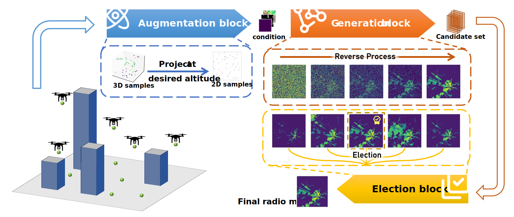
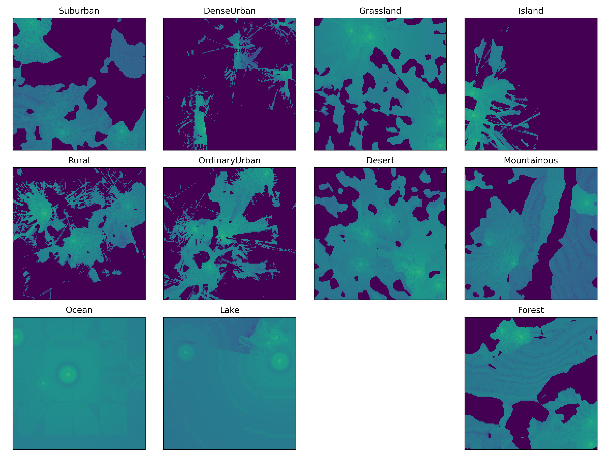
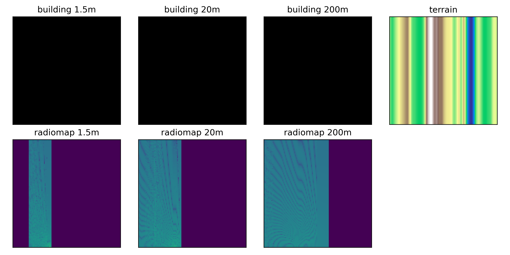

# RadioLAM: A Large AI Model for Fine-Grained 3D Radio Map Estimation

<p align="left">

<a href="" alt="arXiv">
    </a>
</p>

This is the official implementation of "RadioLAM: A Large AI Model for Fine-Grained 3D Radio Map Estimation".



## Preparation
### Python Environment Config

Please run command ```pip install -r requirements.txt``` to install the supporting packages.

### Accelerate Environment Config
The model uses the Hugging Face Accelerate library for multi-GPU training and inference. Accelerate is a library that enables training and inference at scale made simple, efficient and adaptable. Refer in [Accelerate](https://huggingface.co/docs/accelerate/index).

The Accelerate configuration files are located in the acc_config folder, with separate YAML files for training and testing. You can check the meaning of each parameter at [Accelerate Command Line](https://huggingface.co/docs/accelerate/package_reference/cli).

After you’ve configured your environment, you can test your setup with command ```accelerate test```, which launches a short script to test the distributed environment.


### Dataset Config
1. Get dataset in [SpectrumNet](https://spectrum-net.github.io/). Refer in [SpectrumNet github](https://github.com/spectrum-net/spectrum-net.github.io).
2. Download and unzip the ```PPData5D-success.zip```.



3. Removing the **bad data**. Their characteristic is that only part of the radio map area is valid, and a more easily identifiable feature is that only one dimension of the corresponding terrain information is valid, while the other dimension has completely identical information.



4. Open ```data_process/dataset.py``` and set ```SpectrumNetDatasetPath``` to the extracted dataset path.


## Training

### Cold Start Phase Expert Training
1. Open ```config.py``` and find ```TRAIN_3D_UNet```, then config the model save path, batch size, epochs and scheduler cfg.
2. Also in ```config.py``` and ```TRAIN_3D_UNet```, config the Geographic_type (value be like ```'07.Rural'``` (domain expert), ```'urban'```(shared expert))
3. Run command ```accelerate launch --config_file acc_config/train.yaml muti_train_gen.py``` to train the expert model. Adjust train data set settings in ```data_process/dataset.py```.

### Cold Start Phase Router Training
1. Open ```config.py``` and find ```ROUTER_CONFIG```, then config the path.
2. Run command ```accelerate launch --config_file acc_config/train.yaml muti_train_router.py``` to train the router model.


### Fine-tune Phase Training
1. Open ```config.py``` and find ```FT_CONFIG```, then config the path (router path and all weight path is need). 
2. Run command ```accelerate launch --config_file acc_config/train.yaml muti_FT.py``` to Fine-turn the model.

## Inference

### Inference Config
Open ```config.py``` and find ```MoG_TEST_CONFIG```, then config your model paths.

### Test
Run command ```accelerate launch --config_file acc_config/test.yaml muti_test.py``` to evaluate the model on the test set. Adjust test data set settings in ```data_process/dataset.py```.


## BibTex Formatted Citation

If you find this repo useful, please cite:
```
@misc{liu2025radiolamlargeaimodel,
      title={RadioLAM: A Large AI Model for Fine-Grained 3D Radio Map Estimation}, 
      author={Zhiyuan Liu and Qingyu Liu and Shuhang Zhang and Hongliang Zhang and Lingyang Song},
      year={2025},
      eprint={2509.11571},
      archivePrefix={arXiv},
      primaryClass={eess.SP},
      url={https://arxiv.org/abs/2509.11571}, 
}
```

## Acknowledgement

We acknowledge the authors of the following repos:

https://github.com/huggingface/accelerate (Accelerate)

https://github.com/SingleZombie/DL-Demos/tree/master/dldemos/ddim (DDIM code reference)

https://github.com/deepseek-ai/DeepSeek-MoE (MoE reference)

https://github.com/spectrum-net/spectrum-net.github.io (Dataset)

